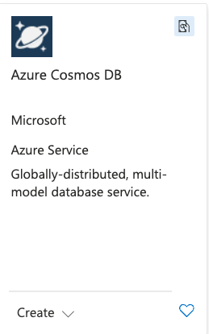
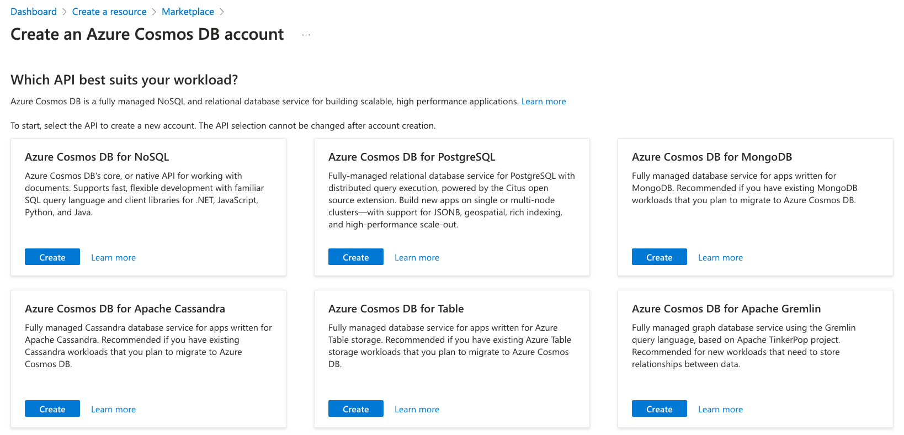
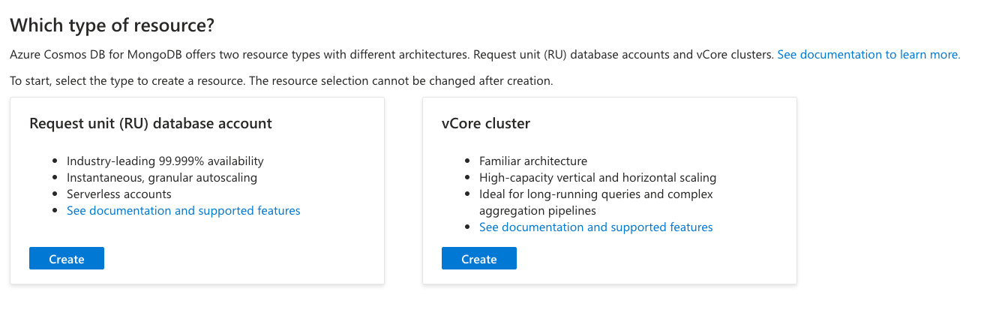
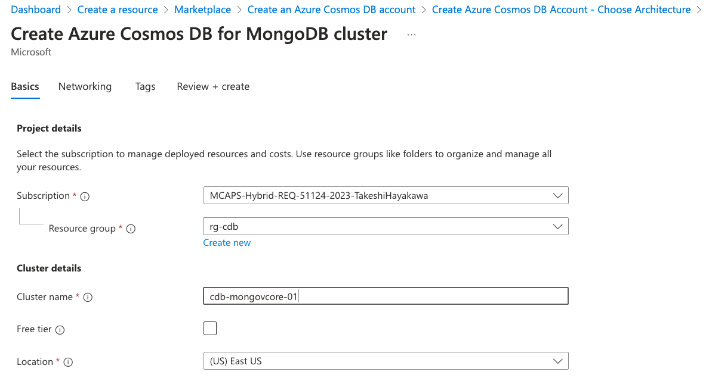
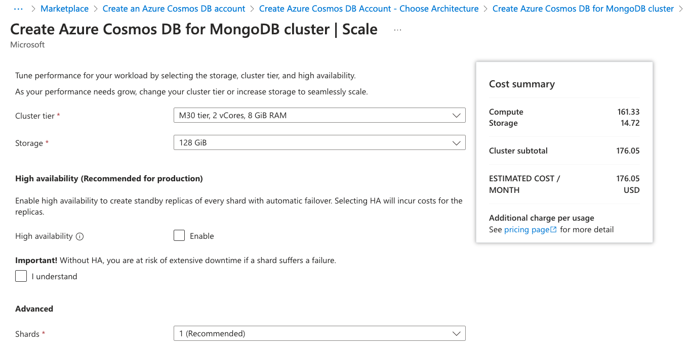

座学テキストは[コチラ](./VectorEssestials.pdf)

# CosmosDBでのベクトル検索 実践編 <BR> (Azure Cosmos DB for MongoDB vCore)

## Mongo DB 概要

- [JSON](https://ja.wikipedia.org/wiki/JavaScript_Object_Notation)もしくは[BSON](https://ja.wikipedia.org/wiki/BSON)を保存・抽出できるドキュメントデータベース&NoSQLデータストア
- インメモリで高速動作
- データの入出力はAPI(関数)で操作(=SQLは使えない)
- 並列処理対応
- 集計パイプラインによるわかりやすい集計・データ処理記述

## Cosmos DBファミリーでのMongoDB API

- Cosmos DBにおけるMongo DB APIは2つのデプロイオプションがある

### Mongo DB API (RUベース)

- CosmosDB for NoSQLと同一のアーキテクチャーを持つ
- データの読み書きに関してはMongoDBの関数が利用できる(互換性が高い)
- RUの増減で処理キャパシティが変わる。オーバー分はHTTP429が返る。
- 内部的にはマスター以外に3つのレプリカを持つため可用性が高い
- プロビジョニングされたRUとストレージの合算

### Mongo DB vCore (vCoreベース)

- CosmosDB for PostgreSQLのように、ノードをデプロイして利用する
- 基本1node。処理に応じてもう1node足すことができる(将来的にはさらに足せるようになる。。。かも)
- サーバークラス(Tier)を指定してデプロイする。サーバークラスは以下から選択。

|クラス|vCore|メモリ|
|---|---|---|
|M25|2(Burst可)|8GB|
|M30|2|8GB|
|M40|4|16GB|
|M50|8|32GB|
|M60|16|64GB|
|M80|32|128GB|
|M200|64|256GB|
|M300|96|384GB|

- ストレージは以下の中からコンピュートと独立して選択。プロビジョニング(確保した)分について月単位の課金となる。

|サイズ|
|---|
|64GB / 128GB / 256GB / 512GB / 1,024GB / 2,048GB|

- HAは単純にコンピュートとストレージが倍になる

- RUベースのMongoDBでは難しかった集計や複雑な抽出にもサーバークラスの範囲内で対応ができる

## Cosmos DB for MongoDB vCoreの機能概要

- Mongo DB **互換** NoSQL (v6.0相当)
- VMベース。性能クラスを選んで利用 (M20~M300)
- コンピュート・メモリがノード単位で確保されており、  
  計算量が多くなってもHTTP429(リクエスト超過エラー)にならない
- ベクトル関連機能
## Cosmos DB for MongoDB vCoreのサービス作成

- Azure Portalを開く
- 「リソースの作成」を選択し、検索窓に"Cosmos DB"を入力
- "Cosmos DB"から「作成」を選択

- "Azure Cosmos DB for MongoDB"の"Create"を選択

- "vCore Cluster"を選択

- 以下の情報を入力

|項目|入力値|備考|
|---|---|---|
|Subscription|任意||
|Resource Group|任意||
|Cluster Name|任意(一意名)||
|Free Tier|(チェックされていないこと)|リージョンで一つ<BR>ストレージ32GBまで|
|Location|East US|(Japanは近日追加予定)|



- "Configure"を押下


- Cluster Tier, StrageについてはデフォルトのままでOK


- Importantのチェックボックスをチェックする(非HA構成時のリスクを承認)


- Configureを押下し元の画面に戻る

- 以下の情報を入力する

|項目|入力値|備考|
|---|---|---|
|Mongo DB Version|6.0(Default)||
|Admin username|(任意)||
|Password|(任意)||
|Confirm Password|(Passwordと同じ)||

- "Review/Create"を押下

- 内容を確認してCreate

※　デプロイには通常10分ほど掛かる

## Cosmos DB for MongoDB vCoreの基本操作

- mongoshでの操作
  - 接続
    - Azure CosmosDB for MonogDB API vCoreのブレードから、「クイックスタート」を選択
    - "Open MongoDB (vCore) shell"を選択して起動する。パスワード入力が必要。
  - Mongosh基本
    - JavaScriptメソッドを呼び出す。メソッドの引数にJSONを渡すのが基本。
    
    ```javascript
    db.<col>.insertOne(
        {
            "_id":1,
            "value":"Hello World"
        }
    )
    ```
    - dbは固定、次の`<col>`はコレクション名を記述する

  - データベース操作
    |操作|コマンド|備考|
    |----|----|----|
    |データベースの一覧表示|show dbs|mongosh専用コマンド|
    |データベースの切替|use <db名>|mongosh専用コマンド<BR>存在しない名前の場合は新規データベースに切り替わる。ドキュメントが登録された時点でデータベースができる|
    |現在のデータベースの表示|db||
    |データベースの削除|db.dropDatabase()|use <db名>ののちに実行|
  - コレクション操作
    |操作|コマンド|備考|
    |----|----|----|
    |コレクションの一覧表示|show collections|mongosh専用コマンド|
    |コレクションの作成|db.createCollection()||
    |コレクションの変更|db.\<colls\>.renameCollection()||
    |コレクションの削除|db.\<colls\>.drop()||
  - アイテム操作
    |操作|コマンド|備考|
    |----|----|----|
    |アイテムの作成|db.\<colls\>.insertOne()/insertMany()||
    |アイテムの検索|db.\<colls\>.find()||
    |アイテムの更新|db.\<colls\>.updateOne()/updateMany()||
    |アイテムの削除|db.\<colls\>.deleteOne()/deleteMany()||
  - 演算子
    - 演算子はfind()などでフィルタ条件を作成する時に利用する
        |演算子種類|演算子(例)|備考|
        |---|---|---|
        |比較演算子|\$eq,\$gt,\$gte,\$in,\$lt,\$lte,\$ne,\$nin||
        |論理演算子|\$and,\$not,\$nor,\$or||
        |要素演算子|\$exists,\$type||
        |評価演算子|\$expr,\$jsonSchema,\$mod,\$regex,\$text,\$where||
        |配列演算子|\$all,\$elemMatch,\$size||
        |投影演算子|\$,\$elemMatch,\$meta,\$slice||
        |その他演算子|\$comment,\$rand,\$natural||
    - `db.<colls>.find()`の例
       - 事前データ作成
        - 以下のプログラムをmongoshから実行する。
        ```javascript
        db.orders.insertMany([
          { customer_id: 1, amount: 200, status: 'shipped', items: 3 },
          { customer_id: 2, amount: 150, status: 'processing', items: 1 },
          { customer_id: 1, amount: 600, status: 'delivered', items: 8 },
          { customer_id: 3, amount: 300, status: 'shipped', items: 2 },
          { customer_id: 4, amount: 450, status: 'canceled', items: 5 }
        ]);
        ```
      - クエリ実行
      ```JavaScript
      db.orders.find({"amount":{"$gte":300}})
      ```
      - 結果
      ```json
      [
        {
          _id: ObjectId("6597ae7185a8fea5bb7006bb"),
          customer_id: 1,
          amount: 600,
          status: 'delivered',
          items: 8
        },
        {
          _id: ObjectId("6597ae7185a8fea5bb7006bc"),
          customer_id: 3,
          amount: 300,
          status: 'shipped',
          items: 2
        },
        {
          _id: ObjectId("6597ae7185a8fea5bb7006bd"),
          customer_id: 4,
          amount: 450,
          status: 'canceled',
          items: 5
        }
      ] 
      ```
  - 集計パイプライン操作
    - 集計パイプラインとは？
        - 集計パイプラインは、`db.<colls>.aggregate()`で利用されるデータ処理の表現方法
        - 集計パイプラインの構成要素
          - パイプライン
            - パイプラインはステージの配列で表現される
            - 各ステージの処理結果(主としてドキュメント群)は次のステージに引き渡される
          - ステージ
            - 集計演算子等をもって記述されたフィルターやグループ化、計算処理のブロック
            - {}で区切られたドキュメントとして定義される
            - ステージの種類(一部)
              |ステージ|説明|パラメータ|
              |---|---|---|
              |\$match|フィルタ条件を指定する|フィルタ条件|
              |\$group|グループ化を行う|グループ条件|
              |\$sort|ソートを行う|ソート項目、方向|
              |\$limit|結果の上限を指定する|上限数|
              |\$skip|結果のスキップ数を指定する|スキップ数|
              |\$project|フィールドの投影を行う|フィールドリスト|
              |\$unwind|配列を展開する|配列名|
              |\$lookup|外部コレクションからデータを取得する|対象コレクション、フィールド|
              |\$count|結果の件数をカウントする|出力フィールド名|
              |\$addFields|フィールドを追加する|追加フィールド名、式|
              |\$sample|ランダムにドキュメントを抽出する|サンプルサイズ|

    - 集計パターンのサンプル
      - サンプルデータ
        - `find()`のサンプルで作成したデータを利用する
      - 集計パイプラインの実行
        - フィルタ条件を適用してカウント
        ```javascript
        db.orders.aggregate(
          [
              { $match: { status: 'shipped' } },
              { $count: 'shipped_orders' }
          ]
        )
        ``` 
        - 合計・平均
        ```javascript
        db.orders.aggregate(
          [
              { $group: { _id: null, total: { $sum: '$amount' }, average: { $avg: '$amount' } } }
          ]
        )
        ```

- Pythonでの操作
  - 利用するパッケージ(motor)のインストール

  ```python
    pip install motor
  ```

  - サンプルプログラム
    motorを利用してMongoDBに接続し、データを登録するサンプルプログラム

  ```python
  # asyncio + motor example

  import asyncio
  import motor.motor_asyncio
  import os

  # If you run in VSCode/Jupyter/Spyder, 
  # allow nested loop with nest_asyncio.apply()

  #import nest_asyncio
  #nest_asyncio.apply()

  # Connect to MongoDB
  client = motor.motor_asyncio.AsyncIOMotorClient(os.environ['MONGOCONN'])
  db = client['testdb']
  collection = db['testcoll']

  # Delete all documents

  async def create_document(document):
      # Create a new document
      result = await collection.insert_one(document)
      print(f"Created document with id: {result.inserted_id}")

  async def read_document(document_id):
      # Read a document by id
      document = await collection.find_one({"_id": document_id})
      if document:
          print(f"Read document: {document}")
      else:
          print("Document not found")

  async def update_document(document_id, update_data):
      # Update a document by id
      result = await collection.update_one({"_id": document_id}, {"$set": update_data})
      if result.modified_count > 0:
          print("Document updated successfully")
      else:
          print("Document not found")
          
  async def find_document(query):
      # Find first document that matches the query
      cursor = collection.find(query)
      cnt = 0
      
      async for document in cursor:
          cnt += 1
          print(f"Found document: {document}")
          
      if cnt > 0:
          print (f"Found {str(cnt)} documents")
      else:
          print ("Document not found")
      

  async def delete_document(document_id):
      # Delete a document by id
      result = await collection.delete_one({"_id": document_id})
      if result.deleted_count > 0:
          print("Document deleted successfully")
      else:
          print("Document not found")

  async def main():

      document = {"_id":1,"name": "John Doe", "age": 30}
      #await create_document(document)
      await collection.delete_many({})

      for i in range(10):
          document["_id"] = i
          document["name"] = "John Doe" + str(i)
          document["age"] = 30 + i
          await create_document(document)

      await read_document(document["_id"])

      update_data = {"age": 31}
      await update_document(document["_id"], update_data)

      query = {"age":{ "$lt":35 }}
      await find_document(query)

      await delete_document(document["_id"])

  # Run the event loop
  if __name__ == "__main__":
      asyncio.run(main())
  ```

  ## Cosmos DB for MongoDB vCoreでのベクトルデータの取り扱い

- ベクトルデータ関連機能
  - ベクトルインデックス
    - ベクトルインデックスがある場合、ベクトルデータの検索が高速になる。
    - ベクトルインデックスがなければ全検索(ブルートフォース)で検索する。
  - ベクトルインデックスの種類  
    - IVFFlat : 反転ファイルフラットインデックス
      - クラスタ分割して重心を得る
      - 重心に対して近傍検索を行い、その後クラスタの全検索を行う

    - HNSW : 階層化探索可能な小世界 (2023/12プレビュー中)
      - Layer0に全てのデータ、Layer1は間引いたデータ、Layer2はさらに間引いたデータ...と階層を作る
      - 階層ないのデータは、近い範囲で連結しグラフを生成する
      - 最上位レイヤーから近いところを探索してレイヤーを掘り下げていき、目的の近傍データに辿り着く
    - 比較
  
    |観点|IVFFlat|HNSW|全検索|
    |---|---|---|---|
    |検索速度|速い|最速|最遅|
    |検索精度|高|中|最高|
    |インデックス作成|速い|遅い|不要|
    |メモリ使用量|比較的小|比較的大|不要|
  
  - ベクトルインデックスの作成
    - ベクトルインデックスはdb.runCommand()の`createIndexes:`で作成する
      ```javascript
      db.runCommand(
        {
          createIndexes: "<コレクション名>",
          indexes: [
            {
              name: "<インデックス名>",
              key: {
                "vectorContent": "cosmosSearch"
              },
              cosmosSearchOptions: {
                kind: 'vector-ivf',
                numLists:100,
                similarity: 'COS',
                dimensions: 1536
              }
            }
          ]
        }
      )
      ```
    - パラメーターの説明

      共通
      |パラメーター|説明|備考|
      |---|---|---|
      |kind|インデックスの種類|vector-ivf/vector-hnsw|
      |similarity|類似度の計算方法|COS/L2/IP|
      |dimensions|ベクトルの次元数|最大2,000<BR>OpenAI Embeddingは1,536|

      `vector-ivf`のパラメーター
      |パラメーター|説明|備考|
      |---|---|---|
      |numLists|クラスタ数|<推奨値><BR>100万ドキュメントまで:ドキュメント数/1,000<BR>それ以上:SQRT(ドキュメント数)<BR>1を設定するとブルートフォース|
      |nProbes|検索で利用される近くのクラスタ数|デフォルト 1|

      `vector-hnsw`のパラメーター
      |パラメーター|説明|備考|
      |---|---|---|
      |M|レイヤーあたりの接続の最大数|デフォルト 16<BR>2 <= m <= 100|
      |efConstruction|動的リストのサイズ|デフォルト 64<BR>4 <= efConstruction <= 1,000<BR>m*2以上|


  - Vector Search
    - $Searchの"cosmosSearch"機能で実現
    - 検索対象のベクトル配列と、データの中でベクトルインデックスがはられている項目名を指定する
    - パラメータK(上位いくつまで)を指定 
    - mongoshでの実行例
    ```javascript
    db.<colls>.aggregate([
      {
        {
        "$search": {
          "cosmosSearch": {
              "vector": <vector_to_search>,
              "path": "<path_to_property>",
              "k": <num_results_to_return>,
            },
            "returnStoredSource": True }},
        {
          "$project": { "<custom_name_for_similarity_score>": {
                "$meta": "searchScore" },
                  "document" : "$$ROOT"
              }
        }
      }
    ])
    ```

- MongoDB vCoreでのベクトルデータの管理
  1. Mongo DB vCoreのコレクションに対してベクトルインデックスを設定する
  2. テキストデータを準備する
  3. テキスト部分をEmbedding APIを適用してベクトルに変換する
  4. 変換したデータをベクトルとしてMongoDB vCoreに登録する

- MongoDB vCoreでのベクトル検索の実施
  1. 検索対象となるテキストを得る
  1. テキストをEmbedding APIを適用してベクトルに変換する
  1. 変換したベクトルとパラメータを設定してMongo DB vCoreを検索する

### ベクトルデータの格納

- 環境準備
  - Azure OpenAI Serviceの準備
    - `text-embedding-ada-002`をデプロイしておく(可能であればデプロイ名は"embedding01"に)
  - Pythonライブラリの導入
    - `asyncio`,`motor`,`openai`,`langchain`を必要に応じてインストールする
    - IDE(VSCode,Spyder,Jupyter)を利用する場合は`nest_asyncio`をインストールする
  - テストデータのダウンロードと解凍
    - 任意の場所にて以下を実行する
      ```sh
      wget https://github.com/tahayaka-microsoft/CosmosDB_Vectors/raw/main/assets/test1000.tar
      tar -xvf test1000.tar
      ```
      `test1000`ディレクトリのパスを記録する(サンプルアプリの書き換えに利用する)

- サンプルアプリ
```python
import os
import glob

import asyncio
import motor.motor_asyncio
from openai import AzureOpenAI

from langchain.text_splitter import RecursiveCharacterTextSplitter

#import nest_asyncio
#nest_asyncio.apply()

# MongoDBの設定
mongo_conn_str = os.environ["MONGOCONN"]  # MongoDBの接続文字列を設定してください
db_name = "db1"  # データベース名を設定してください
collection_name = "coll_holtest"  # コレクション名を設定してください

model_name = 'embedding01' # OpenAI Studioでデプロイしたモデルの名前

# Azure OpenAIのクライアントを生成
    
client = AzureOpenAI(
    api_key=os.environ["OPENAI_API_KEY"],  
    api_version="2023-12-01-preview",
    azure_endpoint = os.environ["OPENAI_API_URL"]
)

# MongoDB Clientを生成
mongoclient = motor.motor_asyncio.AsyncIOMotorClient(mongo_conn_str)
db = mongoclient[db_name]
collection = db[collection_name]

# ファイルを読みだしてEmbeddingを取得してMongoDBに保存する非同期関数
async def store_embedding(filename):

    with open(filename, 'r',encoding='utf8') as data:
        text = data.read().replace('\n', '')
        
    splitter = RecursiveCharacterTextSplitter(chunk_size=5000)
    chunks = splitter.split_text(text)
    
    for num in range(len(chunks)):
    
        try:
            vectors = client.embeddings.create(model=model_name,input=chunks[num]).data[0].embedding
        
        except Exception as e:
            print (f"Error when calling embeddings.create():[{e}]")

        collection.insert_one({"name":filename,"num":num,"vectors":vectors,"text":chunks[num]})

        print(f"{num}:{filename} Inserted : count = {len(chunks)}")


# メインの非同期イベントループ
async def main():

    # コレクションをクリア
    await collection.drop()
    print("Documents Droped : count = " + str(await collection.count_documents({})) )

    #ベクトルインデックス定義
    await db.command(
      {
        "createIndexes": collection_name,
        "indexes": [
          {
            "name": "idx_vectors",
            "key": {
              "vectors": "cosmosSearch"
            },
            "cosmosSearchOptions": {
              "kind": 'vector-ivf',
              "numLists":100,
              "similarity": 'COS',
              "dimensions": 1536
            }
          }
        ]
      }
    )
    
    # ファイル名をstore_embeddingに引き渡して実行
    for file in glob.glob('d:\\work\\test1000\\*.txt')[0:100]:
        await store_embedding(file)

# main()を呼び出す

if __name__ == '__main__':
    asyncio.run(main())

```

### ベクトル検索の実行

- サンプルアプリ
```python
import os
import motor.motor_asyncio
from openai import AzureOpenAI

# Azure OpenAIの設定
openai_key = os.environ['OPENAI_API_KEY']
openai_endpoint = os.environ['OPENAI_API_URL']
openai = AzureOpenAI(
    azure_endpoint=openai_endpoint,
    api_version='2023-12-01-preview',
    api_key=openai_key)


# MongoDBの設定
mongo_conn = os.environ['MONGOCONN']
mongo_db_name = 'db1'
mongo_collection_name = 'coll_holtest'
client = motor.motor_asyncio.AsyncIOMotorClient(mongo_conn)
db = client[mongo_db_name]
collection = db[mongo_collection_name]

# テキスト入力
text_input = "アメリカ大統領選挙"

# テキストをベクトルに変換
vector = openai.embeddings.create(input=text_input,model='embedding01').data[0].embedding

# ベクトルを使用してMongoDBを検索
# 集計ステージ : query1 .... ベクトル検索
query1 = {
      '$search': {
        "cosmosSearch": {
            "vector": vector,
            "path": "vectors",
            "k": 2,
          },
          "returnStoredSource": True 
      }
     }
# 集計ステージ : query2 .... 表示項目のプロジェクション
query2 = {
       '$project': { 
           "_id" : True,
           "name" : True,
           "num" : True,
           "SimScore": {
              "$meta": "searchScore" 
           },
           "text" : True
       }
}

results = collection.aggregate(pipeline=[query1,query2])

async for result in results:
    print(result)
```


<!--
墓場
|操作|対象|mongosh|python(Motor)|備考|
|---|---|---|---|---|
|ドキュメントの登録|一件|db.(col).insertOne()|||
|ドキュメントの登録|複数|db.(col).insertMany()|||
|ドキュメントのクエリ|複数|db.(col).find()|||
|ドキュメントの更新|一件|db.(col).updateOne()|||
|ドキュメントの更新|複数|db.(col).updateMany()|||
※ 以下の操作はAzure Cloud Shell上で実施することを想定する。
- mongoshインストール
    - 以下のコマンドを入力して"Linux x64"の.tgzパッケージをダウンロードする
    ```
    wget https://downloads.mongodb.com/compass/mongosh-2.1.1-linux-x64.tgz
    ```
    - 以下のコマンドで解凍する
    ```
    tar -xzvf mongosh-2.1.1-linux-x64.tgz
    ```
    >[TIP!]
    >必要に応じてPATHの設定を行う。設定しない場合は起動コマンドはフルパスである必要がある。
  - 練習問題
    1. 以下のドキュメントを作成する
    ```JSON
    {
      "id": 1,
      "name": "John Doe",
      "email": "john.doe@example.com",
      "preferences": {
        "food": "Sushi",
        "color": "Blue"
      },
      "addresses": [
        {
          "type": "Home",
          "postalCode": "123-4567",
          "state": "California",
          "city": "Los Angeles",
          "street": "1234 Palm Street"
        },
        {
          "type": "Work",
          "postalCode": "987-6543",
          "state": "California",
          "city": "San Francisco",
          "street": "4321 Oak Avenue"
        }
      ],
      "membership": {
        "level": "Gold",
        "since": "2015-04-01",
        "expiration": "2024-03-31"
      }
    }
    ```

-->
