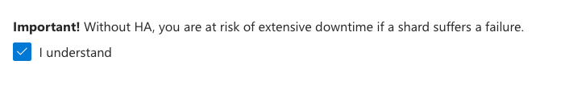

座学テキストは[コチラ](./xxx.pdf)

# CosmosDBでのベクトル検索 実践編 <BR> (Azure Cosmos DB for MongoDB vCore)

## Mongo DB 概要

- [JSON](https://ja.wikipedia.org/wiki/JavaScript_Object_Notation)もしくは[BSON](https://ja.wikipedia.org/wiki/BSON)を保存・抽出できるドキュメントデータベース&NoSQLデータストア
- インメモリで高速動作
- データの入出力はAPI(関数)で操作(=SQLは使えない)
- 並列処理対応
- 集計パイプラインによるわかりやすい集計・データ処理記述

## Cosmos DBファミリーでのMongoDB API

### Mongo DB API (RUベース)

- CosmosDB for NoSQLと同一のアーキテクチャーを持つ
- データの読み書きに関してはMongoDBの関数が利用できる(互換性が高い)
- RUの増減で処理キャパシティが変わる。オーバー分はHTTP429が返る。
- 内部的にはマスター以外に3つのレプリカを持つため可用性が高い
- プロビジョニングされたRUとストレージの合算

### Mongo DB vCore (vCoreベース)

- CosmosDB for PostgreSQLのように、ノードをデプロイして利用する
- 基本1node。処理に応じてもう1node足すことができる(将来的にはさらに足せるようになる。。。かも)
- サーバークラス(Tier)を指定してデプロイする。サーバークラスは以下から選択。

|クラス|vCore|メモリ|
|---|---|---|
|M25|2(Burst可)|8GB|
|M30|2|8GB|
|M40|4|16GB|
|M50|8|32GB|
|M60|16|64GB|
|M80|32|128GB|
|M200|64|256GB|
|M300|96|384GB|

- ストレージは以下の中からコンピュートと独立して選択。プロビジョニング(確保した)分について月単位の課金となる。

|サイズ|
|---|
|64GB / 128GB / 256GB / 512GB / 1,024GB / 2,048GB|

- HAは単純にコンピュートとストレージが倍になる

- RUベースのMongoDBでは難しかった集計や複雑な抽出にもサーバークラスの範囲内で対応ができる

## Cosmos DB for MongoDB vCoreの機能概要

- Mongo DB **互換** NoSQL (v6.0相当)
- VMベース。性能クラスを選んで利用 (M20~M300)
- コンピュート・メモリがノード単位で確保されており、  
  計算量が多くなってもHTTP429(リクエスト超過エラー)にならない
- ベクトル関連機能
  - Vector Index (IVFFlat/HNSW)
    - IVFFlat : 反転ファイルフラットインデックス
      - クラスタ分割して重心を得る
      - 重心に対して近傍検索を行い、その後クラスタの全検索を行う
    - HNSW : 階層化探索可能な小世界 (2023/12プレビュー中)
      - Layer0に全てのデータ、Layer1は間引いたデータ、Layer2はさらに間引いたデータ...と階層を作る
      - 階層ないのデータは、近い範囲で連結しグラフを生成する
      - 最上位レイヤーから近いところを探索してレイヤーを掘り下げていき、目的の近傍データに辿り着く
  - Vector Search
    - $Searchの"cosmosSearch"機能で実現
    - 検索対象のベクトル配列と、データの中でベクトルインデックスがはられている項目名を指定する
    - パラメータK(上位いくつまで)を指定 

## Cosmos DB for MongoDB vCoreのサービス作成

- Azure Portalを開く
- 「リソースの作成」を選択し、検索窓に"Cosmos DB"を入力
- "Cosmos DB"から「作成」を選択

- "Azure Cosmos DB for MongoDB"の"Create"を選択

- "vCore Cluster"を選択

- 以下の情報を入力

|項目|入力値|備考|
|---|---|---|
|Subscription|任意||
|Resource Group|任意||
|Cluster Name|任意(一意名)||
|Free Tier|(チェックされていないこと)|リージョンで一つ<BR>ストレージ32GBまで|
|Location|East US|(Japanは近日追加予定)|


- "Configure"を押下


- Cluster Tier, StrageについてはデフォルトのままでOK


- Importantのチェックボックスをチェックする(非HA構成時のリスクを承認)


- Configureを押下し元の画面に戻る

- 以下の情報を入力する

|項目|入力値|備考|
|---|---|---|
|Mongo DB Version|6.0(Default)||
|Admin username|(任意)||
|Password|(任意)||
|Confirm Password|(Passwordと同じ)||

- "Review/Create"を押下

- 内容を確認してCreate

※　デプロイには通常xx分ほど掛かる

## Cosmos DB for MongoDB vCoreの基本操作

- mongoshでの操作
  - 接続
    - Azure CosmosDB for MonogDB API vCoreのブレードから、「クイックスタート」を選択
    - "Open MongoDB (vCore) shell"を選択して起動する。パスワード入力が必要。
  - Mongosh基本
    - メソッドを呼び出す。メソッドの引数にJSONを渡すのが基本。
    ```mongosh
    db.<col>.insertOne(
        {
            "_id":1,
            "value":"Hello World"
        }
    )
    ```
    - dbは固定、次の`<col>`はコレクション名を記述する

  - データベース操作
    |操作|コマンド|備考|
    |----|----|----|
    |データベースの一覧表示|show dbs||
    |データベースの切替|use <db名>|存在しない名前の場合は新規データベースに切り替わる。ドキュメントが登録された時点でデータベースができる|
    |現在のデータベースの表示|db||
    |データベースの削除|db.dropDatabase()|use <db名>ののちに実行|
  - コレクション操作
    |操作|コマンド|備考|
    |----|----|----|
    |コレクションの一覧表示|show cols|
    |コレクションの作成|db.createCollection()||
    |コレクションの変更|db.<コレクション名>.renameCollection()||
    |コレクションの削除|db.<コレクション名>.drop()||
  - アイテム操作
    |操作|コマンド|備考|
    |----|----|----|
    |アイテムの作成|db.<コレクション名>.insertOne()/insertMany()||
    |アイテムの検索|db.<コレクション名>.find()||
    |アイテムの更新|db.<コレクション名>.updateOne()/updateMany()||
    |アイテムの削除|db.<コレクション名>.deleteOne()/deleteMany()||
  - 演算子
    - 演算子はfind()などでフィルタ条件を作成する時に利用する
        |演算子種類|演算子(例)|備考|
        |---|---|---|
        |比較演算子|$eq,$gt,$gte,$in,$lt,$lte,$ne,$nin||
        |論理演算子|$and,$not,$nor,$or||
        |要素演算子|$exists|$type|
        |評価演算子|$expr,$jsonSchema,$mod,$regex,$text,$where||
        |配列演算子|$all,$elemMatch,$size||
        |投影演算子|$,$elemMatch,$meta,$slice||
        |その他演算子|$comment,$rand,$natural||
  - 集計パイプライン操作
    - 集計パイプラインとは？
    - 集計パターン
        - カウント
        - 合計・平均
        - その他

- 練習問題
    1. 以下のドキュメントを作成する
    ```JSON
    ```

- Pythonでの操作
  - 利用するパッケージ(motor)のインストール
  - サンプルプログラム


## Cosmos DB for MongoDB vCoreでのベクトルデータの取り扱い

- MongoDB vCoreでのベクトルデータの管理
  1. Mongo DB vCoreのコレクションに対してベクトルインデックスを設定する
  1. テキストデータを準備する
  1. テキスト部分をEmbedding APIを適用してベクトルに変換する
  1. 変換したデータをベクトルとしてMongoDB vCoreに登録する

- MongoDB vCoreでのベクトル検索の実施
  1. 検索対象となるテキストを得る
  1. テキストをEmbedding APIを適用してベクトルに変換する
  1. 変換したベクトルとパラメータを設定してMongo DB vCoreを検索する

### ベクトルデータの格納

- 環境準備

- サンプルアプリ

- ベクトル生成

### ベクトル検索の実行

- サンプルアプリ

- ベクトル検索

<!--
墓場
|操作|対象|mongosh|python(Motor)|備考|
|---|---|---|---|---|
|ドキュメントの登録|一件|db.(col).insertOne()|||
|ドキュメントの登録|複数|db.(col).insertMany()|||
|ドキュメントのクエリ|複数|db.(col).find()|||
|ドキュメントの更新|一件|db.(col).updateOne()|||
|ドキュメントの更新|複数|db.(col).updateMany()|||
※ 以下の操作はAzure Cloud Shell上で実施することを想定する。
- mongoshインストール
    - 以下のコマンドを入力して"Linux x64"の.tgzパッケージをダウンロードする
    ```
    wget https://downloads.mongodb.com/compass/mongosh-2.1.1-linux-x64.tgz
    ```
    - 以下のコマンドで解凍する
    ```
    tar -xzvf mongosh-2.1.1-linux-x64.tgz
    ```
    >[TIP!]
    >必要に応じてPATHの設定を行う。設定しない場合は起動コマンドはフルパスである必要がある。

-->
